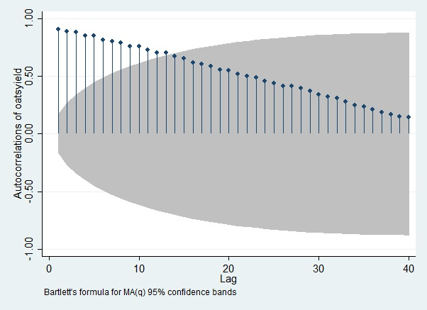

> A graphic representation of data abstracted from the banks of every computer in the human system. Unthinkable complexity. Lines of light ranged in the nonspace of the mind, clusters and constellations of data. Like city lights, receding.
> - William Gibson (brainyquote.com)

# Curriculum Vitae

A copy of my latest CV can be found [here](Abigail Reid CV 2018.pdf).

# LinkedIn

Click [here](http://www.linkedin.com/in/abigail-kate-reid) to access my LinkedIn account.



### Markdown

Markdown is a lightweight and easy-to-use syntax for styling your writing. It includes conventions for

```markdown
Syntax highlighted code block

# Header 1
## Header 2
### Header 3

- Bulleted
- List

1. Numbered
2. List

**Bold** and _Italic_ and `Code` text

[Link](url) and 
```

For more details see [GitHub Flavored Markdown](https://guides.github.com/features/mastering-markdown/).

### Jekyll Themes

Your Pages site will use the layout and styles from the Jekyll theme you have selected in your [repository settings](https://github.com/akbreid/personal-site/settings). The name of this theme is saved in the Jekyll `_config.yml` configuration file.

### Support or Contact

Having trouble with Pages? Check out our [documentation](https://help.github.com/categories/github-pages-basics/) or [contact support](https://github.com/contact) and we’ll help you sort it out.
